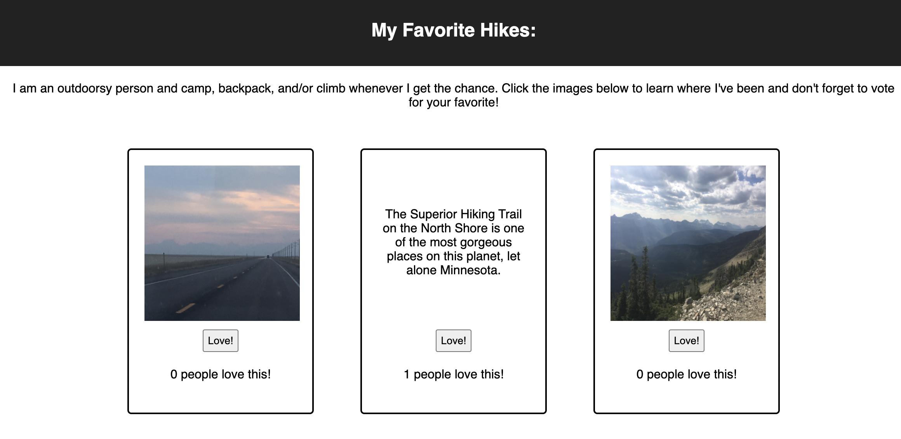

# My Favorite Hikes

## Description

_2 Day Sprint_

This project was intended to utilize the skills and knowledge learned this week about creating web apps with React. The idea was to design a photo gallery app with the capacity to display a list of images, use a "like" button to track and display the total number of likes that a photo has, and conditional rendering to display a description of the photo when clicked.

## Screen Shot

## Installation

1. Using provided database.sql file, use a database manager of your choice (Postico is recommended) to create a local database with the listed table name and structure.
2. Begin running your local database by running brew services start postgresql in a terminal.
3. Navigate to the root directory of the project in another terminal.
4. Run "npm install" in the terminal to install dependencies locally.
5. Run "npm run server" in your terminal to start the project's local server.
6. Run npm run client in another terminal to start the client page.
7. Stop the local server by pressing ctrl-c.
8. Open a browser window and navigate to http://localhost:3000/ to use the app.

## Built With
- REACT.js
- Node.js
- Axios
- Express
- HTML 5
- CSS 3
- Javascript
- Material-ui

## Acknowledgement
Thanks to [Prime Digital Academy](www.primeacademy.io) for downloading all this code into my brain!

## Support
If you have suggestions or issues, please email me at [mary.mettille.brist@gmail.com]
